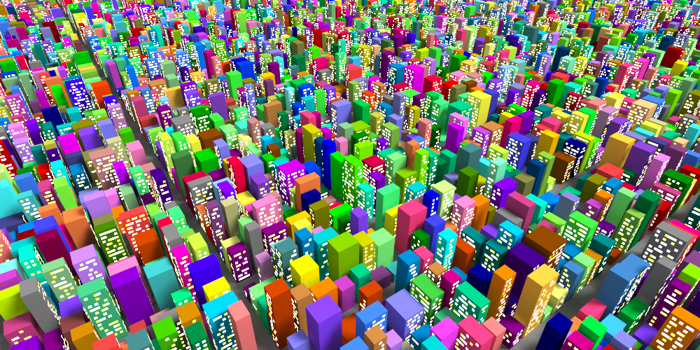
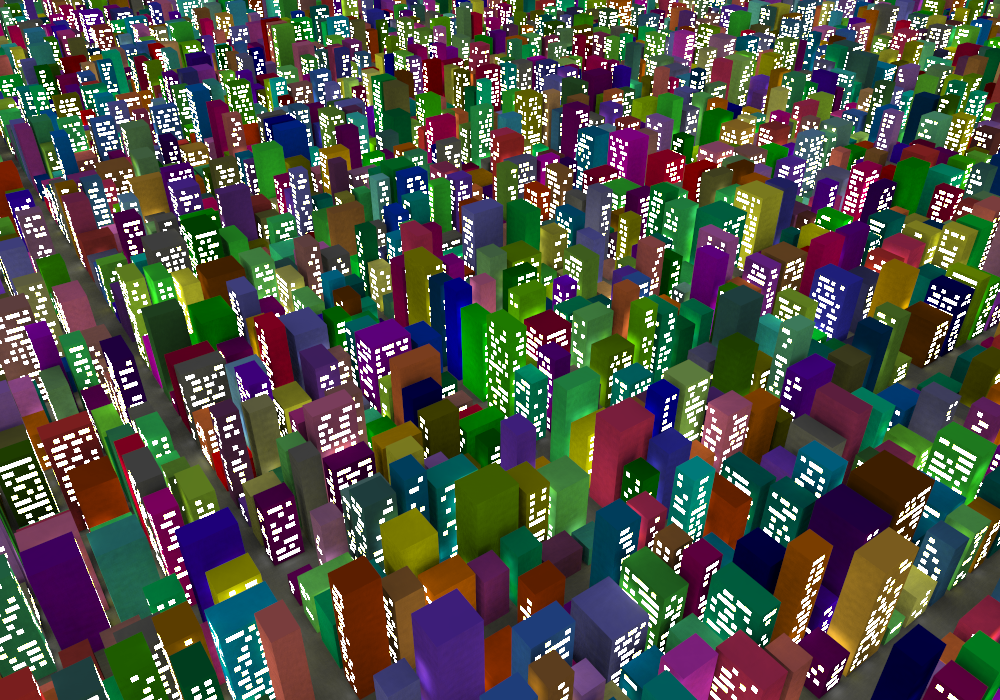
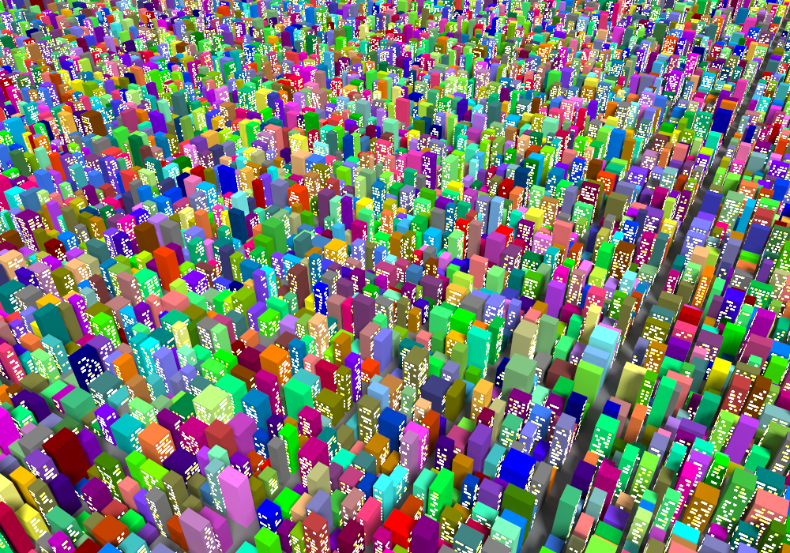
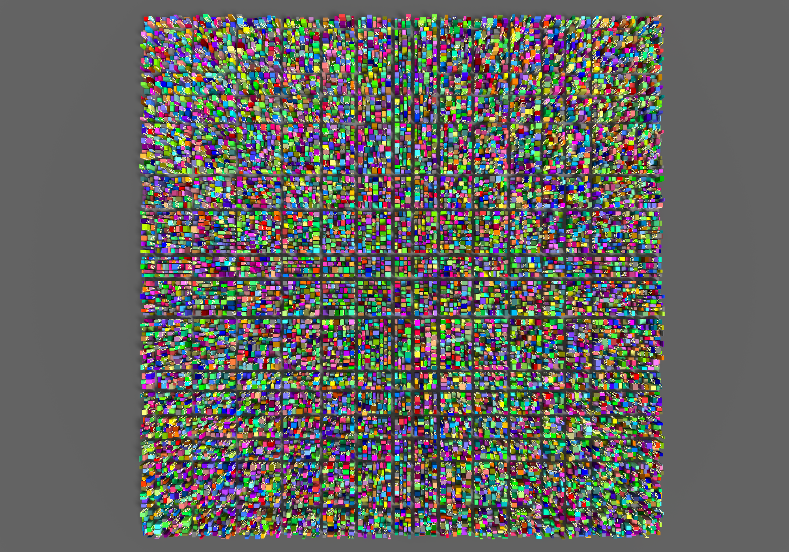
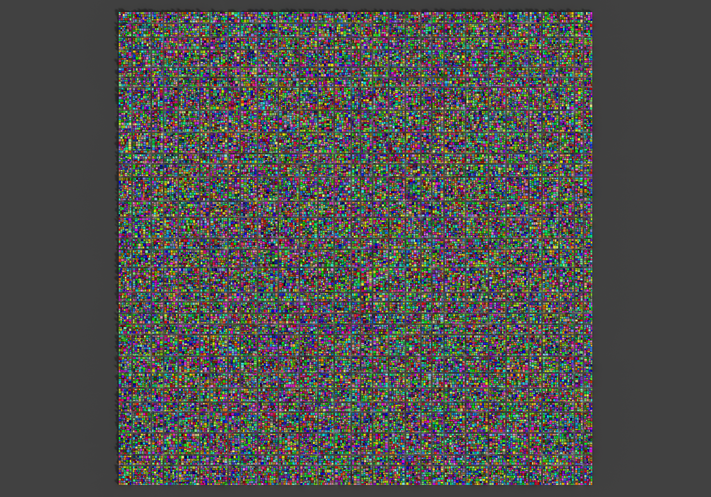

# voxel-city

A script that generates a colorful "low-voxel" (like low-poly but for voxels) city. It produces a `.vox` file that can be rendered with [MagicaVoxel](https://ephtracy.github.io/). It also produces a `.png` floorplan image of the city.

[Blog Post](https://blog.dennis.life/2020/08/08/voxel-city-generation/)



## Running

Running requires [Python 3](https://www.python.org/), as well as the [Pillow](https://pillow.readthedocs.io/en/stable/installation.html) Python library (for writing the PNG).

Then simply run with (where my `python` references `python3`):
```
python voxel_city.py
```
Note that this takes about 70 seconds to execute (on my machine). When executed with assertions disabled, it runs in about 55 seconds. This is done as follows:
```
python -O voxel_city.py
```

Note that I use Python's type annotations, where I use [mypy](http://mypy-lang.org/) to perform the type checking (`mypy voxel_city.py`).

## Rendering

The .vox file can be rendered with [MagicaVoxel](https://ephtracy.github.io/). (It runs with Wine - for *nix users)

Before rendering, I adjusted the first 3 colors in the color-palette (used for the building windows) to be emissive.









## License
BSD-3 - See the `LICENSE` file
